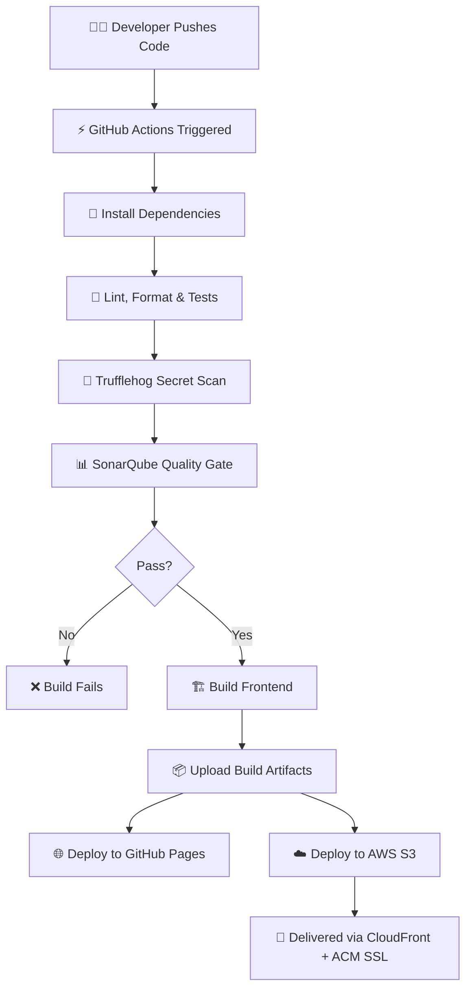

# 📌 TaskFlow - Modern Task Management Application


TaskFlow is a **production-ready task management system** built with **React 18**, powered by a modern **CI/CD pipeline** and deployed on **GitHub Pages and AWS (S3 + CloudFront + ACM)**.
It features advanced task tracking, filtering, and responsive UI, ensuring both **developer productivity** and **enterprise-grade reliability**.

---

## 🚀 Features

* **Complete Task Management**: Create, read, update, delete tasks
* **Advanced Filtering**: Search, filter by status/priority/category
* **Smart Sorting**: Sort by multiple fields with asc/desc
* **Real-time Stats**: Track task completion & overdue items
* **Responsive Design**: Mobile-first with Tailwind CSS
* **Validation & Error Handling**: Client-side form validation
* **Accessibility**: WCAG compliant
* **Testing**: Comprehensive test coverage with Jest & React Testing Library

---

## 🛠️ Tech Stack

* **Frontend**: React 18, Tailwind CSS, Lucide React
* **Testing**: Jest, React Testing Library, PropTypes
* **CI/CD**: GitHub Actions
* **Code Quality**: ESLint, Prettier, SonarQube, Trufflehog
* **Cloud Hosting**: GitHub Pages, AWS S3
* **CDN & Security**: AWS CloudFront, AWS ACM
* **IaC**: Terraform

---

## 🏗️ High-Level Workflow



---
## ☁️ Infrastructure Overview

```mermaid
flowchart LR
User[User] --> CF[AWS CloudFront]
CF --> ACM[AWS ACM Certificate]
CF --> S3[AWS S3 Bucket (Static Hosting)]
User --> GH[GitHub Pages]
GH -.->|Backup Hosting| User

```

---

## 📂 Project Structure

```plaintext
├── 📁 .github/workflows/     # CI/CD workflows
│   └── ci_cd.yaml
├── 📁 infra/                 # Terraform IaC
│   ├── main.tf
│   ├── variables.tf
│   ├── outputs.tf
│   └── provider.tf
├── 📁 src/
│   ├── components/           # Reusable UI components
│   ├── pages/                # Page-level views
│   ├── context/              # Global state
│   ├── hooks/                # Custom hooks
│   ├── utils/                # Helpers
│   └── __tests__/            # Unit & integration tests
├── 📄 package.json
├── 📄 jest.config.js
├── 📄 sonar-project.properties
├── 📄 tailwind.config.js
├── 📄 .eslintrc.js
├── 📄 .prettierrc
├── 📜 LICENSE
└── 📖 README.md
```

---

## 🔄 CI/CD Pipeline

| Stage      | Tools                       | Purpose                               |
| ---------- | --------------------------- | ------------------------------------- |
| Linting    | ESLint, Prettier            | Code consistency & formatting         |
| Testing    | Jest, React Testing Library | Unit & integration tests              |
| Security   | Trufflehog                  | Detect secrets in code                |
| Quality    | SonarQube                   | Static analysis & code quality gate   |
| Deployment | GitHub Pages, AWS S3/CDN    | Multi-target hosting & HTTPS delivery |

---

## 📦 Installation

1. **Clone the repository**

   ```bash
   git clone <repository-url>
   cd taskflow
   ```

2. **Install dependencies**

   ```bash
   npm install
   ```

3. **Setup environment variables**
   Create a `.env` file based on `.env.example`:

   ```bash
   REACT_APP_API_URL=http://localhost:3001/api
   REACT_APP_ENVIRONMENT=development
   ```

4. **Run development server**

   ```bash
   npm start
   ```

5. **Run tests**

   ```bash
   npm test
   ```

6. **Build for production**

   ```bash
   npm run build
   ```

---

## 🧪 Testing

```bash
# Watch mode
npm test

# Coverage report
npm run test:coverage

# Lint check
npm run lint

# Auto-fix lint issues
npm run lint:fix
```

---

## 🧩 Infrastructure as Code (Terraform)

* **S3**: Static hosting bucket
* **CloudFront**: Global CDN + caching
* **ACM**: SSL certificate for HTTPS
* **Outputs**: Website & CDN URLs

---

## 📈 Roadmap

* [ ] API integration
* [ ] Real-time collaboration
* [ ] Dark mode support
* [ ] Keyboard shortcuts
* [ ] Export functionality
* [ ] Mobile app (React Native)

---

## 🤝 Contributing

1. Fork the repository
2. Create feature branch (`git checkout -b feature/amazing-feature`)
3. Commit changes (`git commit -m 'Add amazing feature'`)
4. Push to branch (`git push origin feature/amazing-feature`)
5. Open Pull Request

---

## 📜 License

This project is licensed under the MIT License – see the [LICENSE](LICENSE) file for details.

---